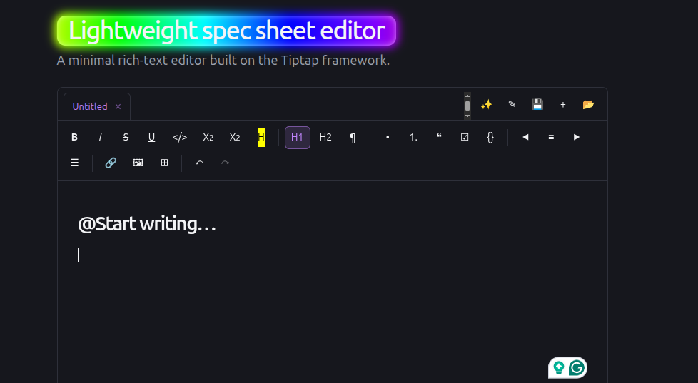

# Spec Ops Editor

A lightweight editor for spec-driven development with a chatbot for templates.



Built on [Tiptap](https://tiptap.dev/) and React, designed for writing technical specifications, RFCs, and design documents with minimal friction.

## What is included

The default app mounted from `src/App.tsx` renders `SimpleEditor`, a local-first
Tiptap editor for drafting specs, RFCs, and technical design notes. Additional
Tiptap template code for collaboration and Tiptap Pro AI lives under
`src/components/tiptap-templates/`, but that template is not mounted by default.

## Features

### Rich-text editing
- Headings, paragraphs, blockquotes, and horizontal rules
- Bold, italic, underline, strikethrough, code, subscript, and superscript
- Text color and highlight
- Text alignment (left, center, right, justify)
- Bullet, ordered, and task lists
- Code blocks with syntax-aware formatting
- Tables with row/column management
- Images and emoji
- Math expressions via Tiptap's mathematics extension
- Link insertion and editing
- Typography niceties (smart quotes, dashes, ellipses)

### Spec-driven workflow in the default editor
- **Spec template chatbot** — a built-in assistant for generating boilerplate spec sections (problem statement, goals, non-goals, design, alternatives, rollout) from a short prompt
- Slash commands and mentions for quickly inserting editor blocks
- Unique IDs on headings and other blocks for stable references
- Multiple in-memory documents with open, save as HTML, and save as Markdown actions

### Optional/template capabilities
- Real-time collaboration powered by Yjs and Tiptap Cloud provider code
- Collaboration carets to show other users' cursors
- Tiptap Pro AI menu components and Notion-like editor template
- Table-of-contents node and drag/context-menu components available in the source tree

### Developer experience
- React 19 + TypeScript + Vite
- Global CSS/SCSS styling
- ESLint configured for React and TypeScript

## Getting started

Use Node 22 for local development. This repository includes `.nvmrc` for
version managers that support it.

Before installing, configure Tiptap Pro registry access as described below. The
dependency tree includes private Tiptap Pro packages, so a plain install on a
fresh machine will fail without registry credentials.

```bash
npm install
npm run dev
```

The dev server runs on Vite's default port (typically `http://localhost:5173`).

### Tiptap Pro registry access

This project currently declares `@tiptap-pro/extension-ai` and
`@tiptap-pro/provider` in `package.json`. A full `npm install` / `npm ci`
therefore requires access to Tiptap's private registry.

1. Create a local `.npmrc` from `.npmrc.example`.
2. Set `TIPTAP_REGISTRY_TOKEN` in your shell or replace the placeholder locally.
3. Keep `.npmrc` out of git; it is already ignored.

Without this registry token, npm will fail with a 403/404 while fetching the
Tiptap Pro packages.

### AI configuration

The default editor can be used without AI. To enable the template assistant and
inline completion, either configure Azure OpenAI from the in-app settings panel
or create a local `.env.local` from `.env.example`.

Important: Vite exposes all `VITE_*` variables to the browser bundle. Do not use
production API keys in a public deployment. For production, proxy Azure OpenAI
requests through a backend and keep provider secrets server-side.

## Scripts

| Command | Description |
| --- | --- |
| `npm run dev` | Start the Vite dev server with HMR |
| `npm run build` | Type-check and build for production |
| `npm run preview` | Preview the production build locally |
| `npm run lint` | Run ESLint over the project |

## Project structure

```
src/
  components/
    simple-editor/        # Main editor shell
    spec-template-chat/   # Template chatbot
    tiptap-extension/     # Custom Tiptap extensions
    tiptap-node/          # Custom node views
    tiptap-templates/     # Pre-built spec templates
    tiptap-ui/            # Editor UI controls
    tiptap-ui-primitive/  # Low-level UI primitives
  contexts/               # React contexts
  hooks/                  # Shared hooks
  lib/                    # Utilities
  styles/                 # Global SCSS
```
